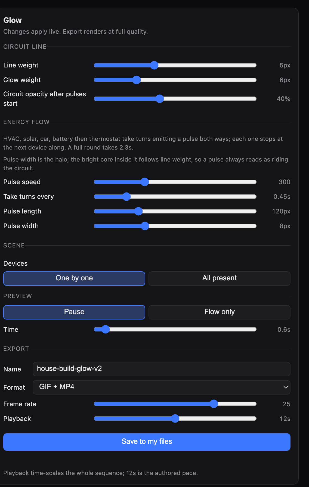

# Glow studio

A local tuning studio for the Renew Home house-build animation — an isometric
home that opens up, gains devices, then has energy travel around a circuit as
pulses, each device emitting in turn.

Sliders change the animation live in the browser; the export button runs the
real render pipeline at full quality with whatever is on screen.



## Run it

```bash
./studio-setup.sh          # stages a working copy into /tmp (see note below)
python3 /tmp/glow-studio/studio-server.py
```

Then open <http://127.0.0.1:3477/>.

Requires `python3`, `ffmpeg`, and Google Chrome at the standard macOS path.

## Controls

**Line weight** and **glow weight** — the width of the circuit's bright core
and of the halo behind it. **Pulse width** is the halo around a travelling
pulse; the bright core inside it follows line weight, so a pulse always reads
as riding the circuit rather than sitting beside it.

**Circuit opacity after pulses start** — the line draws itself in at full
strength, then settles to this level once the pulses begin, so the pulses read
as the event and the line as the wiring.

The five devices take turns emitting, in the order HVAC, solar, car, battery,
thermostat. Each emission travels out along the circuit in **both** directions
and stops at the next device, where it is absorbed: the head halts on arrival
while the tail keeps closing, so a pulse grows out of the sender and shrinks
into the receiver.

Device positions were measured against the circuit rather than estimated —
every device sits within 3.7px of the path, so pulses genuinely appear to leave
the device. The legs they travel:

| leg | length | travelled by |
|---|---|---|
| thermostat ↔ HVAC | 210px | HVAC, backward |
| HVAC ↔ car | 343px | HVAC, forward |
| car ↔ battery | 244px | car, forward |
| battery ↔ solar | 272px | battery, forward |
| solar ↔ thermostat | 372px | solar, forward |

**Pulse speed**, **take turns every**, and **pulse length** set the pacing.
Reach is not a control — the geometry above decides it.

An earlier ending sent evenly spaced pulses around the whole circuit instead of
emitting them per device. It is no longer in the panel but survives as
`?source=loop`, which also re-enables the `pulses` and `cycles` parameters.

Solar's forward leg crosses the point where the circuit path opens. SVG dashes
do not wrap across that seam, so a pulse spanning it is drawn as two dashes
that together total the right length.

**Export** — name, format (GIF / MP4 / both), frame rate, and playback length.
Progress is reported frame by frame. Each export also writes a
`<name>.params.json` sidecar, so any file you keep carries the settings that
produced it.

Note that playback length *time-scales* the whole sequence rather than trimming
it — 12s is the authored pace.

## How it works

`house-animation-glow.html` is the whole animation. Its `render(t)` is a pure
function of `t` in `[0,1]`: no timers, no CSS transitions, no dependence on
frame history. That is what makes headless capture reproducible — each frame is
rendered by a separate Chrome process, and identical input must give identical
output.

The same file serves the live studio and the renderer:

| URL | effect |
|---|---|
| `/` | live studio with the controls panel |
| `?t=0.42` | one static frame, panel suppressed |
| `?ui=0` | suppress the panel |
| `?from=&to=` | render a slice of the timeline |
| `?bg=%23060606` / `?bg=none` | backdrop, or transparent |
| `?source=&showLine=&lineDim=…` | every pulse parameter |

Parameters not shown in the panel — line colour, glow spread, pulse weight,
house fade — are baked to their chosen values but still accept a URL override,
so a render can deviate without the panel growing back.

`render-gif.sh` walks `?t=` across the timeline with headless Chrome, then
assembles the frames with ffmpeg. `FRAMES_DIR` caches one capture so the GIF and
MP4 encodes share it rather than capturing twice.

`studio-server.py` serves the page and exposes `POST /export`, which starts a
background render and reports progress on `GET /job/<id>`.

Two rendering details worth preserving:

- **Never dither this artwork.** Flat vector frames use only a few hundred
  distinct colours, so they fit GIF's 256-colour table losslessly and a dither
  pattern only sprays noise over the flat background. Measured: `dither=bayer`
  gave RMSE 3.54 against source, `dither=none` gave 0.08 — and a smaller file.
- **A pulse crossing the path's seam is drawn as two dashes.** The circuit is
  an open path and SVG dashes do not wrap across its ends, so a span over that
  point is written as two dash runs totalling the right length.

## Layers

The animation composites keyed PNG layers rather than redrawing the artwork.
`docs/EXTRACTION.md` records how they were pulled out of Figma and the three
traps involved — including that Figma renders each shape's own fill as pure
black against a `#060606` background, which is what makes keying possible at
all, and that `contentsOnly: true` destroys that distinction.

## Note on `/tmp`

The studio is staged into `/tmp` rather than run in place because macOS blocks
the host app's dev-server process from reading anything under `~/Desktop`
("Operation not permitted" / "No permission to list directory"). `/tmp` is
cleared on reboot, so re-run `studio-setup.sh` before starting the server again.

Exports land in the staged directory and are offered as download links in the
page, since that same restriction stops the server writing back to `~/Desktop`.
