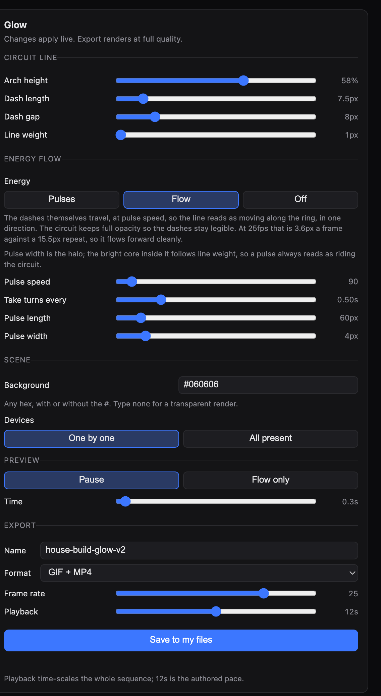

# Glow studio

A local tuning studio for the Renew Home house-build animation — an isometric
home that opens up, gains devices, then has energy travel between them along
dashed arches.

Sliders change the animation live in the browser; the export button runs the
real render pipeline at full quality with whatever is on screen.



## Run it

```bash
./studio-setup.sh          # stages a working copy into /tmp (see note below)
python3 /tmp/glow-studio/studio-server.py
```

Then open <http://127.0.0.1:3477/>.

Requires `python3`, `ffmpeg`, and Google Chrome at the standard macOS path.

## Controls

### Circuit line

The devices are joined by five arches, in a ring: thermostat, HVAC, car,
battery, solar, back to the thermostat. Each arch is a quadratic Bezier lifted
above the straight line between two device centres, and **arch height** is that
lift as a share of the chord.

**Dash length** and **dash gap** set the dash pattern, and **line weight** its
thickness. Line weight also drives the bright core of a travelling pulse, so a
pulse reads as riding the arch rather than sitting beside it.

Device centres were measured from the layer positions rather than estimated.
The arches and their lengths:

| arch | length |
|---|---|
| thermostat → HVAC | 124px |
| HVAC → car | 341px |
| car → battery | 265px |
| battery → solar | 209px |
| solar → thermostat | 372px |

### Energy flow

**Pulses** — the five devices take turns emitting, in the order HVAC, solar,
car, battery, thermostat. Each emission travels out along every arch that
device touches and stops at the far device, where it is absorbed: the head
halts on arrival while the tail keeps closing, so a pulse grows out of the
sender and shrinks into the receiver. **Pulse speed**, **take turns every**,
**pulse length** and **pulse width** set the pacing and weight.

**Flow** — the dashes themselves travel, so the line reads as moving along the
ring. Beware of aliasing here: a dash pattern that advances more than half its
repeat between frames reads as drifting *backwards*. The panel computes this
live from the dash length, gap, speed and export frame rate, and names the
maximum safe speed when you cross the line. At the default 12/8 dashes, 25fps
and 230px/s the pattern moves 9.2px a frame against a 20px repeat, which is
fine; at 7px dots it measured −2.5px a frame, i.e. backwards.

**Off** — the arches draw in and stay put. Both Flow and Off hold the circuit
at full opacity, since there are no pulses for it to step back behind.

### Scene

**Background** takes any hex, with or without the `#`, plus `none` for a
transparent render. The house fills follow it: the layers are pure greyscale, so
an SVG filter ramps each channel from the background at 0 to the stroke colour
at 1, which keeps the fills opaque occluders — a blend mode would let lower
layers show through the roof planes. Above 50% background luminance the stroke
end flips dark, or the house would dissolve into a light backdrop.

**Devices** arrive one by one, or start all present.

Two retired options survive as URL parameters: `?layout=spokes` swaps the ring
for four arches radiating out of the solar panels, and `?layout=wires` restores
the original isometric perimeter circuit. `?source=loop` sends evenly spaced
pulses around the whole path instead of emitting them per device.

**Export** — name, format (GIF / MP4 / both), frame rate, and playback length.
Progress is reported frame by frame. Each export also writes a
`<name>.params.json` sidecar, so any file you keep carries the settings that
produced it.

Note that playback length *time-scales* the whole sequence rather than trimming
it — 12s is the authored pace.

## How it works

`house-animation-glow.html` is the whole animation. Its `render(t)` is a pure
function of `t` in `[0,1]`: no timers, no CSS transitions, no dependence on
frame history. That is what makes headless capture reproducible — each frame is
rendered by a separate Chrome process, and identical input must give identical
output.

The same file serves the live studio and the renderer:

| URL | effect |
|---|---|
| `/` | live studio with the controls panel |
| `?t=0.42` | one static frame, panel suppressed |
| `?ui=0` | suppress the panel |
| `?from=&to=` | render a slice of the timeline |
| `?bg=%23060606` / `?bg=none` | backdrop, or transparent |
| `?energy=pulses\|flow\|off` | how energy reads |
| `?layout=ring\|spokes\|wires` | connection geometry |
| `?arch=&dashLen=&dotGap=&pulseSpeed=…` | every line and pulse parameter |

Parameters not shown in the panel — line colour, glow spread and weight, the
post-pulse circuit opacity, house fade — are baked to their chosen values but
still accept a URL override, so a render can deviate without the panel growing
back.

`render-gif.sh` walks `?t=` across the timeline with headless Chrome, then
assembles the frames with ffmpeg. `FRAMES_DIR` caches one capture so the GIF and
MP4 encodes share it rather than capturing twice.

`studio-server.py` serves the page and exposes `POST /export`, which starts a
background render and reports progress on `GET /job/<id>`.

Two rendering details worth preserving:

- **Never dither this artwork.** Flat vector frames use only a few hundred
  distinct colours, so they fit GIF's 256-colour table losslessly and a dither
  pattern only sprays noise over the flat background. Measured: `dither=bayer`
  gave RMSE 3.54 against source, `dither=none` gave 0.08 — and a smaller file.
- **The arches grow by subdividing the curve, not by dashes.** The dash pattern
  already occupies `stroke-dasharray`, so the reveal cannot also use it. Each
  arch is a quadratic Bezier, which de Casteljau splits exactly, and the drawn
  curve is regrown each frame from 0 to the reveal fraction.
- **In `?layout=wires`, a pulse crossing the path's seam is drawn as two
  dashes.** That circuit is an open path and SVG dashes do not wrap across its
  ends, so a span over that point is written as two dash runs totalling the
  right length.

## Layers

The animation composites keyed PNG layers rather than redrawing the artwork.
`docs/EXTRACTION.md` records how they were pulled out of Figma and the three
traps involved — including that Figma renders each shape's own fill as pure
black against a `#060606` background, which is what makes keying possible at
all, and that `contentsOnly: true` destroys that distinction.

## Note on `/tmp`

The studio is staged into `/tmp` rather than run in place because macOS blocks
the host app's dev-server process from reading anything under `~/Desktop`
("Operation not permitted" / "No permission to list directory"). `/tmp` is
cleared on reboot, so re-run `studio-setup.sh` before starting the server again.

Exports land in the staged directory and are offered as download links in the
page, since that same restriction stops the server writing back to `~/Desktop`.
